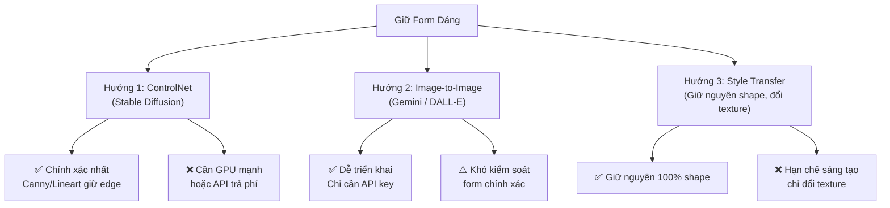
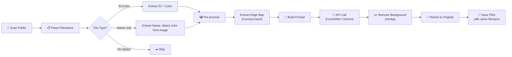
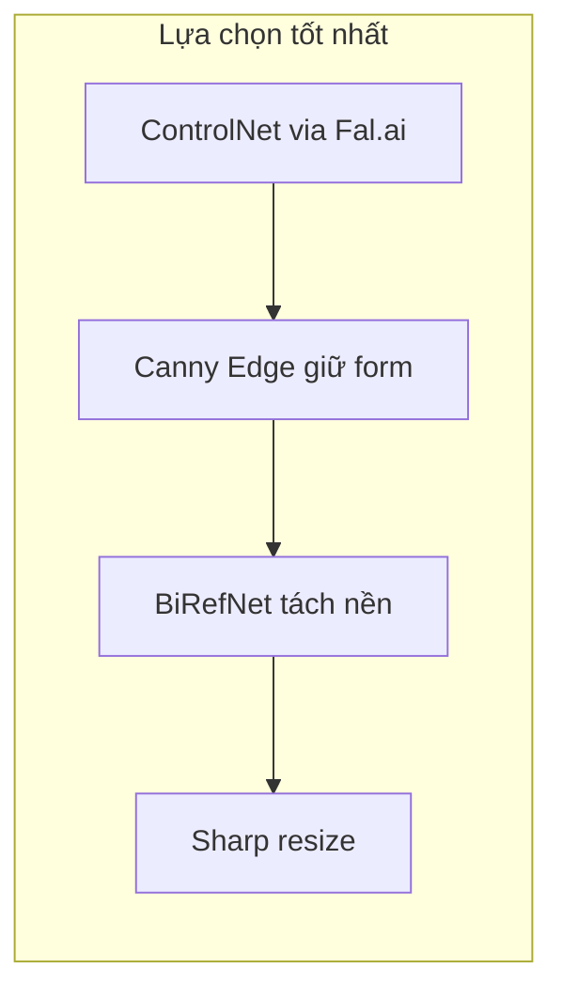

# 🔍 Phân Tích Bài Toán: Tool AI Tái Tạo Clipart Hàng Loạt

---

## 1. Phân Tích Dữ Liệu Thực Tế

Từ thư mục `Choose Hairstyle`, tôi thấy có **52 file**, chia thành **2 nhóm rõ ràng**:

### Nhóm 1: Ảnh có biến thể màu (36 file)
| Pattern | Ví dụ | Ý nghĩa |
|---------|-------|----------|
| `{ID}-{Color}.png` | `16-Black.png`, `16-Blonde.png` | Cùng kiểu tóc ID=16, khác màu |

- **6 kiểu tóc** (ID: 16 → 21), mỗi kiểu có **6 biến thể màu**: Black, Blonde, Brown, Red, Salt-&-Pepper, White
- Đặc điểm: Ảnh **cùng form dáng** nhưng khác màu (đã xác nhận bằng mắt — `16-Black` và `16-Blonde` hoàn toàn giống shape)

### Nhóm 2: Ảnh preview / thumbnail (16 file)
| Pattern | Ví dụ | Ý nghĩa |
|---------|-------|----------|
| `{Tên kiểu}.png` | `Bowl Cut.png`, `Curly.png` | Ảnh preview chỉ có 1 bản, không biến thể màu |

- Bao gồm: Bowl Cut, Buzz Cut, Curly, Fringe, Long Bald, Short Bald, Man Bun, v.v.
- Đặc biệt: `No Option.png` — Ảnh trắng 750 bytes → **placeholder, cần skip**

### Kích thước ảnh
- Khoảng **533×800px** (như ảnh `17-Salt-&-Pepper.png` user chụp)
- File size: 6KB → 86KB (đa số 20-50KB) → ảnh Clipart đơn giản, ít chi tiết

> [!IMPORTANT]
> **Vấn đề cần xử lý**: Tên file có ký tự đặc biệt `&` (ví dụ: `Salt-&-Pepper`). Code phải escape đúng khi parse.

---

## 2. Logic Parse Tên File

```
Filename: "16-Black.png"
         ↓ Split by "-" (chỉ lần đầu)
   ID = "16"
   Color = "Black"

Filename: "17-Salt-&-Pepper.png"  
         ↓ Split by "-" (lần đầu)
   ID = "17"
   Color = "Salt-&-Pepper" → map thành "Salt and Pepper gray"

Filename: "Bowl Cut.png"
         ↓ Không match pattern ID-Color
   ID = null (dùng toàn bộ tên làm ID)
   Color = null (AI tự nhận diện từ ảnh, hoặc user chỉ định)
```

### Bảng ánh xạ màu → Prompt

| Tên trong file | Prompt AI nên dùng |
|----------------|---------------------|
| Black | `jet black color` |
| Blonde | `golden blonde color` |
| Brown | `chestnut brown color` |
| Red | `auburn red color` |
| Salt-&-Pepper | `salt and pepper gray mixed color` |
| White | `pure white / platinum color` |

> [!TIP]
> Nên có bảng **color mapping** cho phép user chỉnh sửa, vì mỗi theme có thể cần diễn đạt màu khác nhau.

---

## 3. Phân Tích Kỹ Thuật: Giữ Form Dáng → Bài Toán Khó Nhất

Đây là **trọng tâm** của cả project. Bạn cần ảnh mới **đúng form** để khi ghép vào mẫu POD không bị lệch.

### 3 Hướng tiếp cận khả thi:



### Hướng 1: ControlNet (Khuyến nghị ⭐)

**Cách hoạt động:**
1. Trích xuất **Canny Edge** hoặc **Lineart** từ ảnh gốc → ra "khung xương"
2. Gửi khung xương + prompt lên Stable Diffusion API (qua **Fal.ai** hoặc **Replicate**)
3. AI gen ảnh mới **trong khuôn khổ** đường nét cũ

**API phù hợp:**
- **Fal.ai**: `fal-ai/fast-sdxl/controlnet` — Có sẵn ControlNet Canny/Lineart
- **Replicate**: `jagilley/controlnet-canny` hoặc `stability-ai/sdxl`

**Ưu điểm:** Kiểm soát form tốt nhất, kết quả chuyên nghiệp
**Nhược điểm:** Phức tạp hơn, cần tuning `controlnet_conditioning_scale` để tìm balance giữa "giữ form" vs "sáng tạo"

### Hướng 2: Gemini Image Generation (Đơn giản nhất)

**Cách hoạt động:**
1. Gửi ảnh gốc + prompt: *"Transform this clipart hair into [STYLE], keep exact same shape and position, [COLOR] color"*
2. Gemini trả về ảnh mới

**Ưu điểm:** Đơn giản, 1 API call, Gemini hiểu ngữ cảnh tốt
**Nhược điểm:** **Không có cơ chế "khóa" form** → có thể sai lệch 10-30% shape

### Hướng 3: Style Transfer thuần túy

**Cách hoạt động:**
1. Giữ nguyên alpha mask (shape) của ảnh gốc
2. Chỉ thay đổi texture/pattern bên trong vùng tóc 
3. Dùng AI gen texture rồi "lắp" vào mask cũ

**Ưu điểm:** Form 100% chính xác
**Nhược điểm:** Kết quả có thể trông "lắp ghép", không tự nhiên bằng ControlNet

> [!WARNING]
> **Thực tế đau lòng**: Không có AI nào đảm bảo giữ form 100% pixel-perfect trừ Hướng 3. ControlNet giữ được ~85-95%. Gemini/DALL-E có thể drift khá nhiều. Cần cho user **preview trước** để quyết định chấp nhận được hay không.

---

## 4. Workflow Xử Lý Chi Tiết



### Bước 1: Scan & Parse (Client-side)
```
Input:  "d:\Tools\tool_image\Choose Hairstyle\"
Output: Array of { filename, id, color, width, height, filePath }
Filter: Skip files < 1KB (like "No Option.png")
```

### Bước 2: Pre-processing
- **Nếu ảnh đã transparent**: Composite lên nền trắng trước khi gửi API (nhiều API không xử lý tốt alpha channel)
- **Extract edge map**: Dùng canvas API (browser) hoặc Sharp (Node.js) để chạy Canny edge detection

### Bước 3: Prompt Construction
```
Template (ControlNet):
"A clipart of {STYLE} hairstyle, {COLOR} hair color, 
 flat illustration style, clean lines, high quality, 
 isolated on white background, no face, no body"

Negative Prompt:
"blurry, low quality, realistic photo, face, body, 
 multiple colors, gradient background, watermark"
```

### Bước 4: API Call
- Rate limiting: ~2-5 requests/giây (tùy API tier)
- Retry logic: 3 lần retry khi fail
- Queue management: Xử lý tuần tự hoặc batch 5-10 ảnh

### Bước 5: Post-processing
- **Remove background**: Dùng `rembg` API hoặc Fal.ai's background removal
- **Resize**: Canvas resize về đúng dimensions gốc
- **Quality check**: So sánh bounding box position với ảnh gốc

---

## 5. Lựa Chọn Công Nghệ

### So sánh API

| Tiêu chí | Fal.ai (SDXL + ControlNet) | Replicate | Gemini Image |
|-----------|---------------------------|-----------|--------------|
| **Giữ form** | ⭐⭐⭐⭐⭐ (ControlNet) | ⭐⭐⭐⭐⭐ (ControlNet) | ⭐⭐⭐ (prompt only) |
| **Chất lượng** | ⭐⭐⭐⭐⭐ | ⭐⭐⭐⭐⭐ | ⭐⭐⭐⭐ |
| **Giá** | ~$0.01-0.03/ảnh | ~$0.02-0.05/ảnh | Free tier có hạn |
| **Tốc độ** | 3-8 giây/ảnh | 5-15 giây/ảnh | 2-5 giây/ảnh |
| **Dễ dùng** | ⭐⭐⭐⭐ | ⭐⭐⭐⭐ | ⭐⭐⭐⭐⭐ |

### Chi phí ước tính cho 200 ảnh
- **Fal.ai**: 200 × $0.02 = **~$4**
- **Replicate**: 200 × $0.03 = **~$6**
- **Gemini**: Free tier 15 RPM → mất ~13 phút, nhưng **miễn phí**

### Gợi ý app stack

| Component | Lựa chọn | Lý do |
|-----------|----------|-------|
| **Frontend** | Electron / Web App (HTML+JS) | Bạn đã quen web stack |
| **Image Processing** | Sharp (Node.js) hoặc Canvas API | Canny edge, resize |
| **AI API** | Fal.ai (primary) + Gemini (fallback) | Best balance |
| **Background Removal** | Fal.ai `birefnet` hoặc `rembg` | Tích hợp sẵn |

---

## 6. Những Thách Thức & Rủi Ro Quan Trọng

### 🔴 Thách thức chính

| # | Thách thức | Mức độ | Giải pháp |
|---|-----------|--------|-----------|
| 1 | **Form drift** — AI gen lệch shape so với gốc | Cao | ControlNet + `conditioning_scale` cao (0.8-1.0) |
| 2 | **Màu không chính xác** — AI gen sai màu "Blonde" thành "Yellow" | Trung bình | Color mapping chi tiết + negative prompt |
| 3 | **Style inconsistency** — 200 ảnh gen ra phong cách không đồng nhất | Trung bình | Dùng cùng seed + cùng model + cùng params |
| 4 | **Tách nền lỗi** — Rembg cắt mất chi tiết tóc mỏng | Trung bình | Dùng model SAM hoặc BiRefNet (tốt hơn rembg) |
| 5 | **API rate limit / timeout** | Thấp | Queue + retry + exponential backoff |

### 🟡 Edge cases cần xử lý

1. **`Salt-&-Pepper`**: Ký tự `&` trong filename → encode đúng
2. **`No Option.png`**: File placeholder → skip
3. **Ảnh đã transparent**: Cần composite lên nền trắng trước khi gửi AI
4. **Nhóm 2 (tên kiểu như `Bowl Cut.png`)**: Không có info màu → cần logic khác (detect từ ảnh hoặc prompt mặc định)

---

## 7. Kết Luận & Khuyến Nghị

### Phương án đề xuất: **Hybrid Approach**



### Ước tính khối lượng code

| Module | Effort | Mô tả |
|--------|--------|--------|
| UI (Config + Preview) | 2-3 ngày | Form nhập API, chọn folder, preview |
| File Parser | 0.5 ngày | Scan + parse filename + read dimensions |
| AI Pipeline | 2-3 ngày | ControlNet integration, prompt builder |
| Post-processing | 1 ngày | Background removal + resize |
| Batch Manager | 1 ngày | Queue, progress bar, error handling |
| **Tổng** | **~7-10 ngày** | Cho bản MVP hoàn chỉnh |

### Câu hỏi cần bạn trả lời trước khi code:

1. **API nào bạn muốn dùng chính?** (Fal.ai / Replicate / Gemini?) — Ảnh hưởng lớn đến kiến trúc
2. **App loại gì?** Web app chạy local (như tool POD trước) hay Electron desktop app?
3. **Nhóm 2 (ảnh không có color)** — Có cần xử lý không hay chỉ focus nhóm có `ID-Color`?
4. **Budget cho API?** Nếu dùng Gemini free thì chậm (~13 phút/200 ảnh), Fal.ai nhanh (~10 phút) nhưng tốn ~$4
5. **Mức độ "giữ form" chấp nhận được?** 100% pixel-perfect (Hướng 3) hay 85-95% (ControlNet)?
